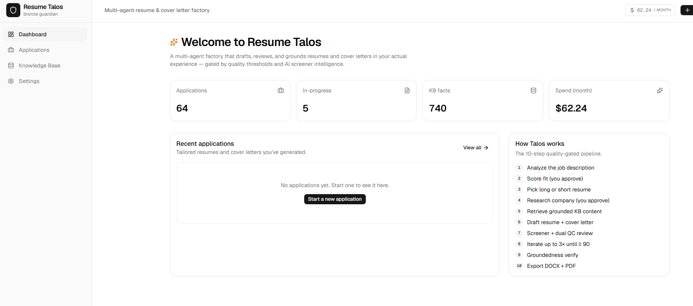
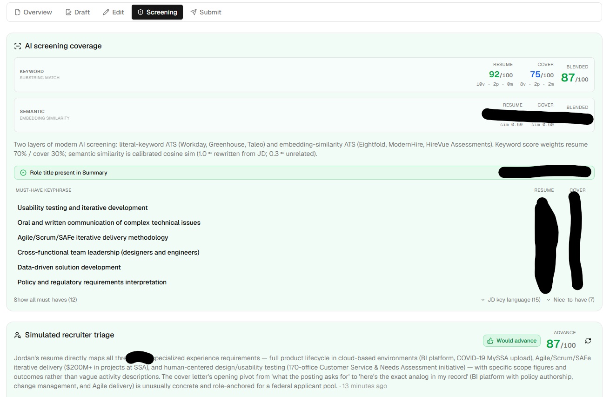
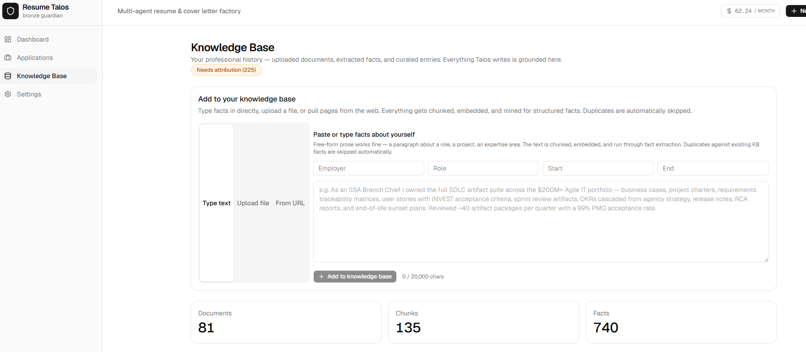
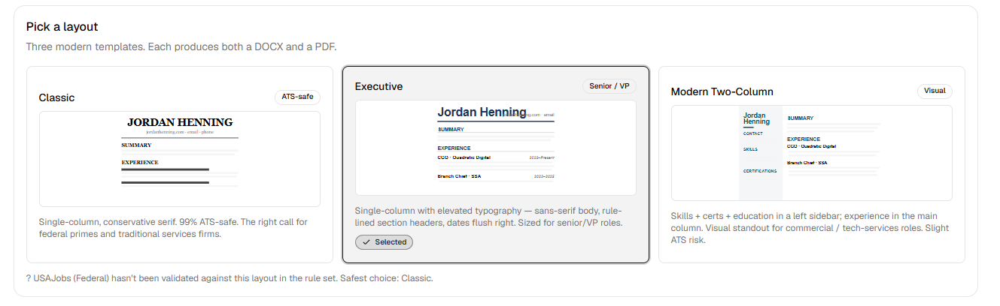
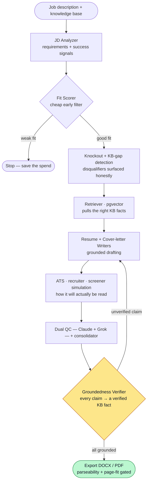

# Resume Talos

**A multi-agent system that writes job-tailored resumes and cover letters that are grounded in your real experience, optimized for AI screeners, and quality-gated — every single claim traced back to a verified fact before anything exports.**

Resume Talos takes a job description and a knowledge base of your professional
history, then runs a fleet of **20 specialized AI agents** to analyze the role,
score fit, retrieve the right evidence, draft and revise, simulate how automated
screeners and recruiters will read the result, and hard-gate on groundedness
before writing a single DOCX or PDF.

The organizing principle is **anti-hallucination**: a resume that invents a
credential is worse than useless. So a Groundedness Verifier sits at the end of
the pipeline and blocks export unless every factual claim traces to a specific
knowledge-base fact.

---

## What it looks like



<table>
<tr>
<td width="50%"></td>
<td width="50%"></td>
</tr>
</table>

<p align="center"><em>Two layers of ATS simulation and a recruiter-triage verdict (left) · a grounded knowledge base every claim traces back to (right)</em></p>



---

## Pipeline



---

## Why it's built this way

| Design decision | Why |
|---|---|
| **Grounded generation with a hard verifier gate** | Every claim in the resume/cover letter must trace to a KB fact ID. The Groundedness Verifier is a blocking gate — no export until it passes. This is what makes AI-written application material trustworthy. |
| **Screener- and recruiter-simulation, not guesswork** | Dedicated agents (ATS simulator, ATS-vendor-aware analysis, recruiter simulator, 7-dimension screener rubric) model how the document will actually be parsed and skimmed — then feed fixes back into revision. |
| **Knockout detection up front** | A KB-gap detector and knockout detector catch disqualifying requirements (missing clearance, cert, degree) *before* spending model budget drafting — and surface them honestly instead of papering over them. |
| **Independent dual QC** | QC Reviewer A (Claude Sonnet) and QC Reviewer B (xAI Grok) review independently; a consolidator merges them. Different model families = genuinely independent second opinions, not an echo. |
| **Per-role multi-provider routing** | Anthropic (Opus/Sonnet/Haiku), Google Gemini, and xAI Grok are each assigned to the roles they're best at, via a per-role model registry with cost tracking and prompt caching. |
| **Cheap filters before expensive drafting** | A Haiku fit-scorer runs first; market research is cached by company; a hard cap of 3 review iterations bounds spend. |
| **Parseability-gated export** | Output isn't just styled — a parseability checker verifies an ATS can actually extract the headings/sections, page-overflow trim keeps it to length, and a mandatory-content enforcer guarantees required items (e.g. specific certifications) survive every pass. |

---

## The agent roster (20 modules)

| Agent | Role |
|---|---|
| `jd-analyzer` | Extract requirements, skills, and success signals from the JD |
| `fit-scorer` | Cheap early filter — is this role worth pursuing? |
| `knockout-detector` · `kb-gap-detector` | Flag disqualifiers and evidence gaps before drafting |
| `market-research` | Company culture/tone (Google-grounded), cached per company |
| `retriever` · `screening-similarity` | pgvector cosine retrieval of the right KB facts |
| `resume-writer` · `cover-letter-writer` | Draft and revise, grounded in retrieved facts |
| `screener` · `recruiter-simulator` · `ats-simulator` · `ats-vendor` | Simulate AI-screener + human-recruiter + ATS-vendor reading |
| `qc-reviewer` · `qc-consolidator` | Dual independent QC review + consolidation |
| `verifier` · `verifier-fix-suggester` | Groundedness gate: every claim → a KB fact, with fix routing |
| `cert-acronyms` · `questionnaire-helper` · `exemplars` | Cert normalization, application-question help, style exemplars |

Supporting subsystems: a **KB pipeline** (`src/lib/kb/`) for ingestion, chunking,
fact extraction, dedup, career-timeline and tenure reasoning; an **export engine**
(`src/lib/export/`) with three resume layouts (classic / executive / modern) in
both DOCX and PDF, plus the parseability, trim, and mandatory-content gates.

---

## Human checkpoints & quality gates

- **Checkpoints:** fit-score approval → long/short variant choice → market-research
  approval before cover-letter writing.
- **Gates:** both QC reviewers > 90 with no high-priority issues → early stop;
  max 3 iterations then escalate to an editable web view; groundedness verifier
  must pass before any DOCX/PDF is written.

## Tech stack

- **App:** Next.js 16 + React 19 + Tailwind v4 + shadcn/ui
- **Data:** Drizzle ORM + Postgres + **pgvector** (1536-dim cosine, HNSW indexes)
- **LLM:** Vercel AI SDK v6 → Anthropic + Google + xAI (+ OpenAI), per-role model
  registry with pricing/cost tracking and a structured agent-run log
- **Export:** DOCX (`docx`) + PDF (`@react-pdf`) in three layouts each

## Project structure

```
src/
├── app/                 # Next.js App Router (dashboard, applications, knowledge-base, settings)
├── lib/
│   ├── agents/          # 20 LLM agent modules
│   ├── kb/              # ingest → chunk → extract → dedup → timeline reasoning
│   ├── export/          # DOCX/PDF layouts + parseability / trim / mandatory-content gates
│   ├── applications/    # application lifecycle, QC loop, versioning, export
│   └── models/          # per-role registry, cost tracking, embeddings
└── db/                  # Drizzle schema + migrations
scripts/                 # KB seed/maintenance + deterministic test & smoke scripts
```

> **Note on data:** the knowledge base and contact details are user-provided and
> live in your database (not in this repo). Seed scripts under `scripts/` show the
> shape; sample contact values are placeholders. Provide your own via the KB
> ingestion UI and settings.

## Dev

```powershell
pnpm dev                 # http://localhost:3200
pnpm exec tsc --noEmit   # type check
pnpm db:studio           # browse the DB
```

---

## About this repository

This is a **clean public snapshot**. The system was designed, built, and iterated privately over months of real use, then published here as a single squashed release — the original commit history is withheld to protect client data and internal IP. The engineering is fully represented; I'm glad to walk through the real development history and the live system on a call.
